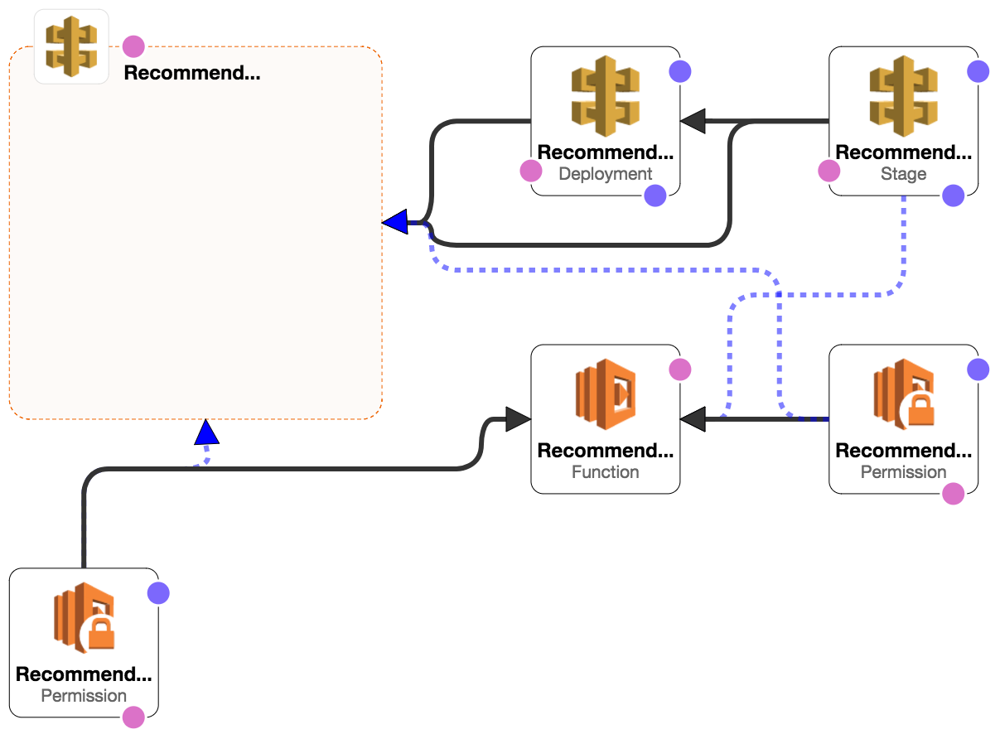

# What is this?

We publish blueprints for serverless projects at Rue La La.

We have developed services requirements for all software at Rue. See [this Google doc](https://docs.google.com/a/ruelala.com/document/d/1U6ONvPqlqzx4KbaMP0pWVMac5TKtYRB66kKjilivleQ/edit?usp=sharing) for dcetails.

Follow these Blueprints to ensure your serverless applications follow these requirements and work seamlessly in Rue infrastructure.

# Here are several compliant implementations

We define a common example, then implement it a number of different ways. You can see the implementations in the subdirectories of this repo.

| Example | Description |
| --- | --- |
| [java-codepipeline-sam](java-codepipeline-sam) | The simplest Java implementation that dispatches API calls and gets URL parameters manually |
| [java-spark-codepipeline-sam](java-spark-codepipeline-sam) | A Java implementation that leverages the [Spark Java](http://sparkjava.com/) web micro-framework to dispatch API calls and parse path parameters |
| [python-jenkins-terraform](python-jenkins-terraform) | - |


## The application

Each application example implements a simple CRUD REST API for shoes on DynamoDB. It's interesting because
- It has multiple REST endpoints
- It implements security
- There are simple data structures

Here's the start of the [Swagger](http://swagger.io/) for this API.

```
swagger: '2.0'
info:
  description: 'This is the Rue Serverless Blueprint API in Swagger. You can find out more about Swagger at http://swagger.io'
  version: 1.0.0
  title: Rue Serverless Blueprint
basePath: /api/v1
schemes:
  - https
consumes:
  - application/json
produces:
  - application/json
paths:
  /shoe:
    post:
      summary: Create a shoe
      parameters:
      - name: shoe
        schema:
          $ref: '#/definitions/Shoe'
        in: body
        required: true
      responses:
        '200':
          description: Id of shoe
          schema:
            type: number
...
```

> HINT: Copy the contents of [this file](swagger.yaml) into the online Swagger Editor http://editor.swagger.io to make sense of it. You can also try out your API from there.

# The Blueprint

> TODO: a sample that uses shorter names so we can see them in the diagram



> TODO: more here

# You have great choices

The Blueprint above is the required end state for serverless applications. You get to pick how to get there. So the Blueprint itself is agnostic to the way you build and deploy it. Your architect will let you know if there are already standards in place for the application you're working on. Otherwise she/he will work with you to create some.

Please note, however, these Blueprints are all designed specific to [AWS](https://aws.amazon.com/) since that is currently Rue's cloud provider. Although we take care where possible to make these Blueprints work on other cloud providers, many of the components in the examples leverage services only available on Amazon.

## Choose your implementation language

| Language | Version | Framework | AWS SDK | Typical Usage |
| --- | --- | --- | --- | --- |
| Python | 2.7 | - | [boto3](https://github.com/boto/boto3), the Python AWS SDK | Front-end APIs that access Storefront databases and services |
| Java | 8 | Basic AWS Lambda `RequestHandler` or [Spark Java](http://sparkjava.com/) web micro-framework | [AWS SDK fo Java](https://aws.amazon.com/sdk-for-java/) Back-end APIs that may require efficient  processing |
| Node | 6.10 | - | - | Trivial CRUD APIs |

## Choose your build

| Mechanism | Tooling | Typical Usecases |
| --- | --- | --- |
| CodePipeline | AWS CodePipeline with AWS CodeBuild (`buildspec.yaml`) | Serverless applications with a serverless build |
| Jenkins | Jenkins pipeline (`Jenkinsfile`) | Serverless applications built using Jenkins pipeline or inheriting legacy codebase |

## Choose your deployment method

| Tool | Notes |
| --- | --- |
| [Serverless Application Model](https://github.com/awslabs/serverless-application-model) (SAM) | AWS provides the SAM, CodePipeline, CodeBuild, and CodeDeploy tools for this |
| [Terraform](https://www.terraform.io/) | Our infrastructure is built and maintained using this technology |
